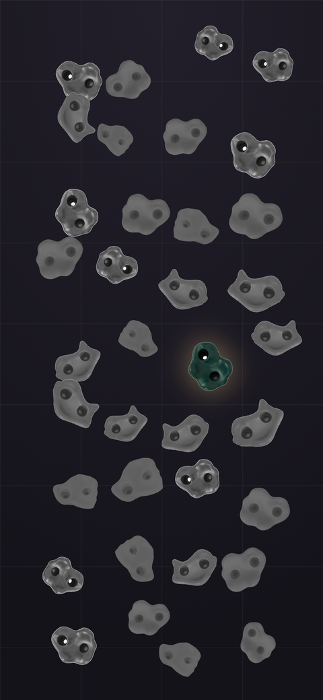
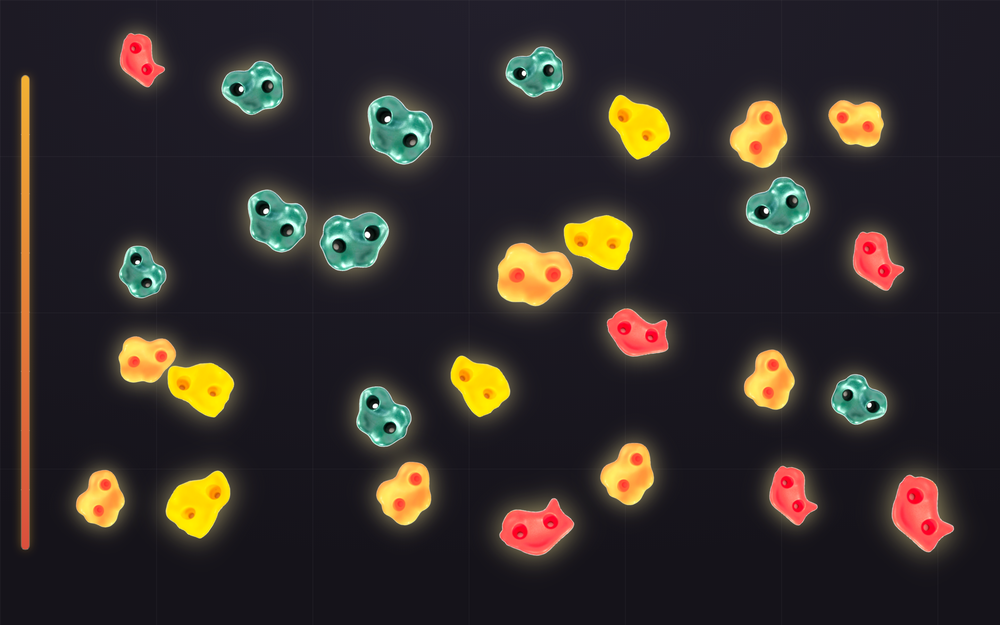

# Process overview

## What I built

**Beta** --- a bouldering wall you climb from memory. Thirty-odd holds scatter a
dark wall, all of them grey. One breathes. Press it and the wall lights a hold;
repeat the route from the bottom and it adds another, until you top out at eight
or fall. The brief forbids instructions, so every piece of teaching is spent
from one budget: the wall is dark, the holds are grey, and the only colour on
the opening screen is the single hold that is moving.

The invariants require a `<nav>` landmark and exactly one `<h1>`, which collides
head on with a brief that forbids the page explaining itself. I did not want to
satisfy that with a decorative heading, so both were made to earn their place:
the `<h1>` is the route's name and is screen-reader only, and the `<nav>` holds
the height gauge, which is genuinely about position on the route and is hidden
until there is a route to be positioned on. `index.html` carries a comment
saying so, where the next change would land.

## The moments that mattered

**1. A test that was right about the wrong thing.** My own spec test asked
whether the page "gives the player a surface to act on" and failed --- every
hold is built by the entry chunk at load, so the shipped `index.html` is an
empty `<main>`. The obvious fix was to relax the selector until the
implementation passed, which would have deleted the question. Instead I moved it
to where it could be answered honestly: boot the real built bundle in jsdom and
ask the live DOM. That catches a failure nothing else in the suite can see ---
the page loads and nothing happens --- which is exactly what a stranger at a
crit would meet.
[`9cc6d73`](https://github.com/comp4020-agentic-coding-studio/comp4020-crit5-ohlai/commit/9cc6d73)

**2. The bug that only playing could find.** Every test passed, so I drove a
real route through the built page and printed what the wall did. Round one
showed *two* holds lighting: the acknowledgement of my own press on the start
hold, then the actual route hold a second later --- identical treatment. Copy
back what you were shown and you fall on move one having done nothing wrong,
which is the worst possible first lesson from a game that has to teach itself.
The rule tests were all correct; the wall was showing the player the wrong move.
The fix is a grammar rather than a tweak: the wall **lights** holds (lifted,
haloed) and the player **grips** them (pushed in, no halo).
[`67421f4`](https://github.com/comp4020-agentic-coding-studio/comp4020-crit5-ohlai/commit/67421f4)

**3. A correction that landed in the harness, not the code.** The holds are four
photographs shot under different light --- green averages a third of yellow's
luminance --- so one `brightness()` cannot be right for all four, and half the
wall vanished into the background. Measuring the files and setting a gain per
hold fixed it, but the first attempt silently did nothing: `var()` inside a
custom property is substituted where that property is *declared*, so
`--dormant` on `:root` resolved `--gain` against `:root` and every hold
inherited the fallback. No warning, no invalid declaration, just a wrong
picture. Both facts went into `CLAUDE.md` rather than into a retry, under a note
that nothing in `check` can catch either and the rendered page is the only
witness.
[`5f1da57`](https://github.com/comp4020-agentic-coding-studio/comp4020-crit5-ohlai/commit/5f1da57)

## What the tests deliberately do not cover

`spec/game.test.ts` greps for the tutorial I might have written at 2am --- a
how-to modal, hint text, "click to start". Passing it means only that I did not
give up and explain. Whether the breathing hold actually teaches the opening
move, whether falling on hold seven of eight feels fair, and whether five
minutes still holds attention are settled by four people at the keyboard while I
stay quiet. `spec/rules.test.ts` covers the one rule that *can* be pinned: on a
wall of thirty, exactly one press survives, so losing is a real risk rather than
a formality.
